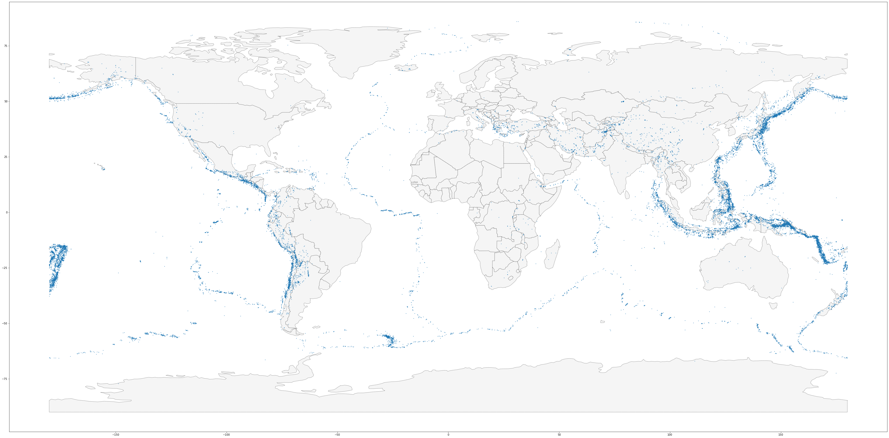

# Maps with Data 
### In this project I created maps with some locations data using the following:

- Geopandas
- Numpy
- The code was also run in a Jupyter notebook in the cloud using Kaggle

# Results
## Volcanoes
### This is a map of all of the volcanoes around the world

## Earthquakes
### This is a map of all of the recorded earthquakes from 1967 to 2016

